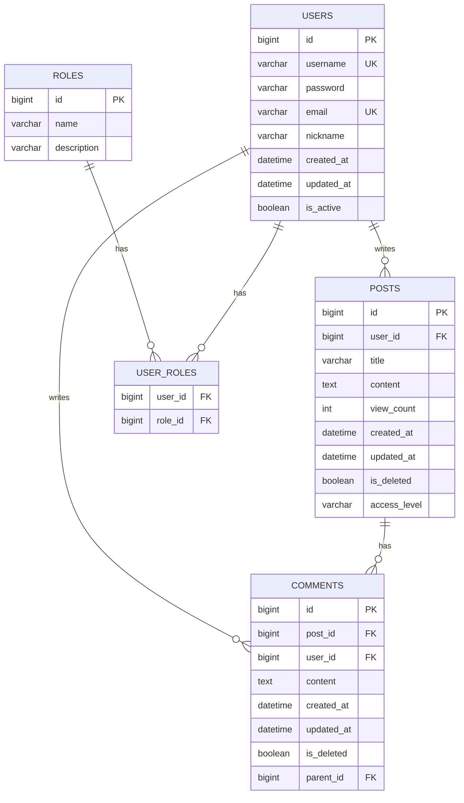

# Goorm Mission
## Spring 프레임워크 고급
> Spring 프레임워크를 사용해 Spring Security 등 다양한 고급 기능을 학습하고 구현합니다.
 Spring Boot와 Spring MVC를 활용하여 웹 애플리케이션을 개발하는 방법을 학습합니다.

### 스프링 프레임워크 고급 미션에 해당하는 내용을 한번에 진행했습니다. 
#### 이번 미션은 문서를 살리는 방향으로 학습했습니다.
- - -
## 프로젝트 초안 [커뮤니티 사이트]
- 사용자들의 커뮤니티 제작을 목표로 하는 사이트를 제작합니다.
- 사용자는 회원 가입을 통해 게시글을 쓰거나 댓글을 남길 수 있습니다.
- 특정 게시글은 특정 사용자만 접근할 수 있도록 해야합니다.
- 서버 구성은 Spring Boot, MySQL로 진행합니다.
- 자료는 재활용할 수 있도록 확장성에 염두하여 프로그래밍을 진행합니다.
- 디자인은 요구 조건에 없었으므로 생각하지 않습니다.
- /admin 페이지는 관리자 권한이 없으면 접근을 제한하며, 회원가입 시 사용자는 기본 권한을 Default로 합니다.

- - -
## 프로젝트 사진

- - -
## DB 구성

#### 작업 순서를 변경해야 원활히 진행할 수 있으므로 순서를 변경했습니다.
- - -
### [기존 미션 순서]
1. 스프링 시큐리티를 사용하여 로그아웃 기능 구현하기
   - Spring Security를 사용하여 로그아웃 기능을 구현합니다.
   - 로그아웃 처리 과정을 설정하고, 로그아웃 기능이 정상적으로 동작하는지 확인합니다.
2. 스프링 시큐리티를 사용하여 회원가입 기능 구현하기
   - Spring Security를 활용하여 회원가입 기능을 구현합니다. 
   - 사용자 정보를 입력받아 데이터베이스에 저장하는 회원가입 로직을 작성합니다.
3. 스프링 시큐리티를 사용하여 로그인 기능 구현하기
   - Spring Security 라이브러리를 사용하여 로그인 기능을 구현합니다. 
   - 사용자 인증 과정을 설정하고, 로그인 폼 및 로그인 처리 로직을 작성합니다.
4. 게시판 화면 구현하기
   - 웹 프론트엔드 기술(HTML, CSS, JavaScript 등)을 사용하여 게시판 화면을 구현합니다. 
   - 게시글 작성, 목록 조회, 상세 보기 등의 기능을 화면에 구현합니다. 구현된 게시판 화면의 결과를 확인합니다.
5. 스프링 부트를 사용하여 웹 어플리케이션 프로젝트 생성하기
   - Spring 부트를 사용하여 웹 애플리케이션 프로젝트를 생성합니다. 
   - 프로젝트 생성 과정에서 필요한 의존성을 추가합니다.
6. 스프링 MVC를 이용하여 간단한 웹 페이지 구현하기
   - Spring 부트와 Spring MVC를 함께 사용하여 웹 애플리케이션을 개발합니다. 
   - 컨트롤러, 서비스, 리포지토리 등의 계층 구조를 구현합니다.
7. 스프링 부트와 스프링 MVC를 활용하여 웹 애플리케이션 개발하기
    - Spring 부트와 Spring MVC를 함께 사용하여 웹 애플리케이션을 개발합니다. 
    - 컨트롤러, 서비스, 리포지토리 등의 계층 구조를 구현합니다.
8. 스프링 시큐리티 기본 설정하기
    - Spring Security를 사용하여 웹 애플리케이션의 기본 보안 설정을 구성합니다. 
    - 기본 로그인 페이지와 사용자 인증을 설정하고, 로그인 후 리다이렉트 동작을 테스트합니다.
9. 스프링 시큐리티 권한 부여 및 접근 제한
    - Spring Security를 사용하여 특정 URL에 대해 권한을 설정합니다.
    - 권한이 없는 사용자가 접근 시 오류 메시지를 반환하도록 설정합니다.
10. Spring MVC에서 유효성 검사 및 예외 처리
    - Spring MVC의 @Valid와 @ExceptionHandler를 사용하여 유효성 검사를 구현합니다.
    - 예외 처리 로직을 추가합니다.
11. Spring MVC에서 인터셉터 구현하기
    - Spring MVC에서 인터셉터를 구현하여 요청과 응답을 가로채고, 처리 전후로 특정 작업을 수행합니다.
12. Spring MVC에서 요청 파라미터 처리하기
    - Spring MVC에서 @RequestParam을 사용하여 URL 쿼리 파라미터나 폼 데이터를 처리합니다.
    - 이를 모델에 전달하는 방법을 구현합니다.
13. Spring MVC에서 모델과 뷰 처리
    - Spring MVC에서 Model을 사용하여 데이터를 뷰로 전달하고, 이를 HTML에서 표시하는 방법을 구현합니다.
    - @ModelAttribute와 @RequestMapping을 활용하여 데이터 바인딩을 처리하고 뷰에 전달합니다.
14. Spring MVC에서 템플릿 엔진 사용 (Thymeleaf)
    - Spring MVC에서 Thymeleaf 템플릿 엔진을 사용하여 동적 웹 페이지를 구현합니다.
    - 서버에서 데이터를 Thymeleaf 템플릿으로 전달하고, HTML 페이지에 동적으로 반영하는 방법을 구현합니다.

- - -
### [작업 상황]
#### 작업의 경우 진척도를 확인을 하며 진행합니다.

- [x] 스프링 MVC를 이용하여 간단한 웹 페이지 구현하기
  - 아래 작업이 완료된다면, 해당 미션 완료
- [x] 스프링 부트를 사용하여 웹 어플리케이션 프로젝트 생성하기
  - [x] Spring Boot 프로젝트 생성하기
  - [x] 의존성 추가
    - Spring Security
    - Spring Web
    - Thymeleaf
    - Lombok
    - Spring Boot DevTools
    - MySQL Driver
    - Spring Data JPA
  - [x] github 연동
  - [x] 요구사항 작성하기 (README.md)
  - [x] Database 기본 설정 (개인 서버 MySQL 연동)
- [x] 스프링 부트와 스프링 MVC를 활용하여 웹 애플리케이션 개발하기
    - [x] 계층 구조 구현
        - Entity : Database Table Mapping
        - Repository : Database 접근 interface
        - Service : 비즈니스 로직 처리
        - Controller : 클라이어트 요청 처리 및 응답 반환
        - DTO : 계층 간 데이터 전송을 위한 객체
        - Config : 보안, 데이터베이스, 웹 설정 등
- [x] 스프링 시큐리티 기본 설정하기
  - [x] 웹 애플리케이션의 기본 보안 설정 구성
  - [x] 기본 로그인 페이지와 사용자 인증 설정
  - [x] 리다이렉트 동작 테스트
- [x] 스프링 시큐리티를 사용하여 회원가입 기능 구현하기
  - [x] 회원가입 기능 구현
  - [x] 데이터베이스에 정상적으로 등록되었는 지 확인
  - [x] 정상적으로 작동하는 지 테스트 (TEST)
  - [x] 회원가입에 발생할 수 있는 오류 예외처리
    - [x] 중복 아이디
    - [x] 중복 이메일
- [x] 스프링 시큐리티를 사용하여 로그인 기능 구현하기
  - [x] 로그인 기능 구현
  - [x] 사용자 인증 과정 설정
  - [x] 로그인 처리 로직
  - [x] 로그인 중 발생할 수 있는 오류 예외처리
    - (제일 어려웠습니다..) 
- [x] 스프링 시큐리티를 사용하여 로그아웃 기능 구현하기
  - [x] 로그아웃 기능 구현
  - [x] 로그아웃 처리 과정 설정 및 동작 확인
- [x] 게시판 화면 구현하기
  - [x] 게시판 페이지
    - [x] Table 형태로 제작
  - [x] 게시판 작성 페이지
    - [x] 제목
    - [x] 내용
    - [x] 취소, 등록
    - [x] 비밀글 설정 (나, 전체)
  - [x] 게시글
    - [x] 글 내용
    - [x] 댓글 작성
- [x] 스프링 시큐리티 권한 부여 및 접근 제한
  - [x] 특정 URL에 대해 권한 설정
  - [x] 권한이 없는 일반 사용자가 접근 시 오류 메시지 반환
- [x] Spring MVC에서 유효성 검사 및 예외 처리
  - [x] @Valid와 @ExceptionHandler를 사용하여 유효성 검사
  - [x] 예외 처리 로직을 추가
- [x] Spring MVC에서 인터셉터 구현하기
  - [x] 인터셉터를 구현하여 요청과 응답을 가로채고, 처리 전후로 특정 작업을 수행
- [x] Spring MVC에서 요청 파라미터 처리하기
  - [x] Spring MVC에서 @RequestParam을 사용하여 URL 쿼리 파라미터나 폼 데이터 처리
  - [x] 이를 모델에 전달하는 것 구현
- [x] Spring MVC에서 모델과 뷰 처리
  - [x] Model을 사용하여 데이터를 뷰로 전달하고, 이를 HTML에서 표시하는 방법 구현
  - [x] @ModelAttribute와 @RequestMapping을 활용하여 데이터 바인딩을 처리하고 뷰에 전달
- [x] Spring MVC에서 템플릿 엔진 사용 (Thymeleaf)
  - [x] Srping MVC에서 Thymeleaf 템플릿 엔진 사용
  - [x] 동적 웹 페이지 구현
  - [x] 서버에서 데이터를 Thymeleaf 템플릿으로 전달, HTML 페이지에 동적으로 반영하는 방법 구현
- - -
### Navigation
#### 페이지 다이어그램

- - -
## 후기
> 진짜 어려웠습니다.. Next.js로는 뚝딱 만들어지던게 오류가 사방으로 터지니까 웃음이 절로 나오더군요..
> 좀더 강해지도록 하겠습니다. 테스트 코드도 적극 활용해야하는데 문서로 쭉 나열하면서 하려니 손이 안가서 못했습니다..
> 계속 인지하면서 열심히 하겠습니다.
